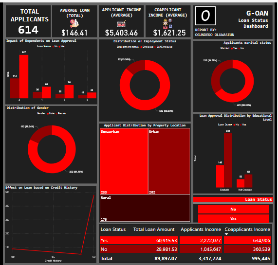

<h1 style='text-align:center; border-bottom:1px dotted white;'> G-OAN </h1>

## Introduction
G-OAN is a fictonal company loan company that want to understand why and how each person is graded 'eligible for a loan' and they are looking to use the data gotten to automate the entire loan process so as to reduce manual input for the validity of each customer.

## PROCESS

### Data Cleaning
After getting the data, I was given the task to clean this data, I prefer working with python to clean my dataset, so I employed the following rules;

1. <b>Data Explorarion</b>: This is where I look through the distribution and see the data types of the columns in the dataset, check for missing values and ensure everything is okay.

2. <b>Data Cleaning</b>: This is where I perform cleaning by going through each of the columns of the data set

3. <b>Data Validation</b>: This is where I look at the previous dataset (pre cleaning) and the new dataset (post cleaning) and appreciate <b>Guido Van Rossum</b> for creating a beautiful language.

4. <b>Extract the clean data</b>: and after all that, save the cleaned data.

### Data Analysis 
After cleaning with python and extracting the data, I took the already cleaned data to PowerBi to perform a proper analysis based on the guiding question.

 
(PowerBi dashboard navypro) 
<a href='https://www.novypro.com/project/g-oan-loan-validation-dashboard'>Click to visit the dashboard.</a>

## Guiding Question
We just want to understand one thing; 
- <b>What makes an individual eligible for a loan?</b>

## Answer to Guiding Question
- One of the most obvious reasons is the applicants credit score, the data showed that the credit score of an individual is an important factor to getting a loan from G-OAN

- Another glaring reason is the applicants property location most of those that their loan were approved lived in the Urban and Semiurban  properties, while very few live in Rural properties, while most of the applicants that were rejected lived in Rural areas.

## General Takeaway
- We had a total of 614 applicants of those 614 applicants 81.76% we male that is about 502 people and then 18.24% were ladies that's also about 112 people, because of the uneven distribution we can say that our customers are mostly male or we can also say that men are more likely to opt for a loan.

- Of all the 614 applications recieved a total of 422 were approved for their loan that is about 68% of the applicants while 192(roughly 31%) were rejected.

- Many of the rejected applicants have something in common, they have very low credit scores, of the 192 applicants that were rejected 95 of them have low credit scores which would be a valid reason for rejecting thier applications.

- Based on the data we had more Graduates than Non gradutes.

## Technology Used
<ul>
<li> Python
<li> Pandas
<li> Numpy
<li> PowerBi
<li> NovyPro (Hosting)
</ul>

<a href="https://oluwaseun-ogundeko.netlify.app/">Learn more about me!</a>

